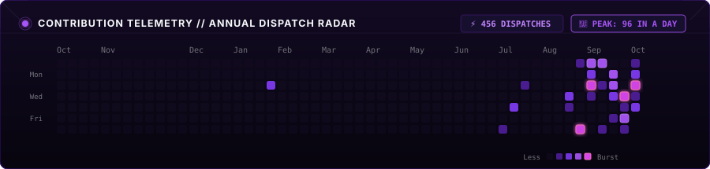

<div align="center">

<!-- ======================================================== -->
<!-- TOP BANNER: DEEP OBSIDIAN & ELECTRIC PURPLE              -->
<!-- ======================================================== -->
<a href="https://github.com/Akshit99999">
  
</a>

<!-- ======================================================== -->
<!-- TYPING BANNER: GROUNDED, CURIOUS, HIGH-ENERGY            -->
<!-- ======================================================== -->
<a href="https://github.com/Akshit99999">
  
</a>

<p align="center">
  
  
  
  
</p>

</div>

---

### 🎒 The Lab Notebook

> *"I’ve always loved taking things apart just to see how the clockwork moves—and then seeing if I can rebuild it a little faster, a little leaner, and a lot more resilient."*

Hey, I’m **Akshit**.

I’m a software engineer and builder driven by genuine curiosity and a love for the craft. I find myself most in my element at the intersections of **computer vision, autonomous multimodal systems, and distributed scale**—tackling the messy, challenging puzzles where real-world sensors, live networks, and AI models meet.

For me, good engineering isn't about piling on bloated abstractions or overly complex scaffolding. It’s about **understanding the physics from first principles**, stripping away the noise, and building solutions that run fast, feel intuitive, and hold up under real-world pressure. 

Give me a good terminal, a black coffee, and an interesting problem, and I'm happily locked in until it's solved.

---

### 🧠 The Engineering Notes

```
┌──[ Guiding Principles ]
│
├── 01 // CURIOSITY FIRST, ALWAYS
│   No black boxes allowed. Whether it's tensor quantization, memory layouts,
│   or raw socket handshakes, I want to truly understand what's happening underneath
│   before trying to optimize it.
│
├── 02 // SENSOR-TO-SCREEN AGILITY
│   Connecting real-world physical signals to clean digital instrumentation:
│   camera feeds, audio waves, and live transit telemetries turned into fast, tactile,
│   responsive interfaces that feel natural to use.
│
└── 03 // CRAFT & RELIABILITY
    Prototyping fast is fun, but shipping systems that stay up under pressure
    is what really counts. I care about strictly typed boundaries, resilient queues,
    and software people can genuinely rely on.
```

---

### 🔬 Frontiers of Exploration

I enjoy moving across whatever layer of the stack the problem demands:

- **👁️ Vision & Edge Optics**  
  Real-time video ingestion (RTSP/WebRTC) under microsecond constraints. Multi-target tracking, low-latency edge inference via TensorRT/ONNX, biometric matching, and tamper-evident audit logging.

- **🤖 Autonomous Multimodal Systems**  
  Building software agents that can genuinely perceive: parsing multi-frame video, pulling live web evidence, reasoning spatially, and orchestrating complex tasks autonomously without constant supervision.

- **🎙️ Speech & Acoustic Modeling**  
  Audio DSP, generative voice pipelines, and low-latency acoustic models that preserve emotional cadence and personal vocal identity across regional dialects.

- **⚡ Fast Distributed Engines**  
  High-concurrency microservices, event streams (Redis Streams, Celery, Channels), and rock-solid relational architectures that hold up under unpredictable real-time telemetry spikes.

- **🎮 Native Runtimes & Kinetic Mechanics**  
  Tinkering with C++ bindings, Flutter/Dart mobile physics, and low-overhead client engines that maintain buttery-smooth 60+ FPS performance.

---

### 🕸️ Patrol Telemetry // Dispatch Radar

<!-- Clean Cyber Violet Contribution Radar (296 Dispatches, Peak: 96 in a day) -->
<div align="center">



<br/><br/>

<!-- Stats Grid: Sleek Deep Purple Theme -->
<table>
  <tr>
    <td width="50%" align="center">
      
    </td>
    <td width="50%" align="center">
      
    </td>
  </tr>
  <tr>
    <td colspan="2" align="center">
      
    </td>
  </tr>
</table>

</div>

---

### 🛠️ The Utility Belt

<table width="100%">
  <tbody>
    <tr>
      <td width="25%"><b>Languages</b></td>
      <td>
        
        
        
        
        
        
        
      </td>
    </tr>
    <tr>
      <td><b>Vision & AI</b></td>
      <td>
        
        
        
        
        
        
        
      </td>
    </tr>
    <tr>
      <td><b>Backend & Systems</b></td>
      <td>
        
        
        
        
        
        
        
      </td>
    </tr>
    <tr>
      <td><b>Frontend & UI</b></td>
      <td>
        
        
        
        
        
        
      </td>
    </tr>
  </tbody>
</table>

---

### 📡 Establish Uplink

Always open to discussing hard engineering problems, computer vision pipelines, autonomous systems, or interesting ideas over coffee.

<p align="center">
  <a href="mailto:akshitsharma684@gmail.com">
    
  </a>
  &nbsp;&nbsp;
  <a href="https://github.com/Akshit99999">
    
  </a>
  &nbsp;&nbsp;
  <a href="https://linkedin.com">
    
  </a>
</p>

<div align="center">
  <p><sub><i>"Always building, always learning."</i></sub></p>
</div>
